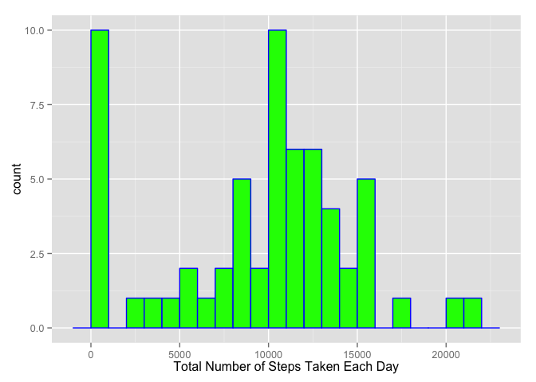
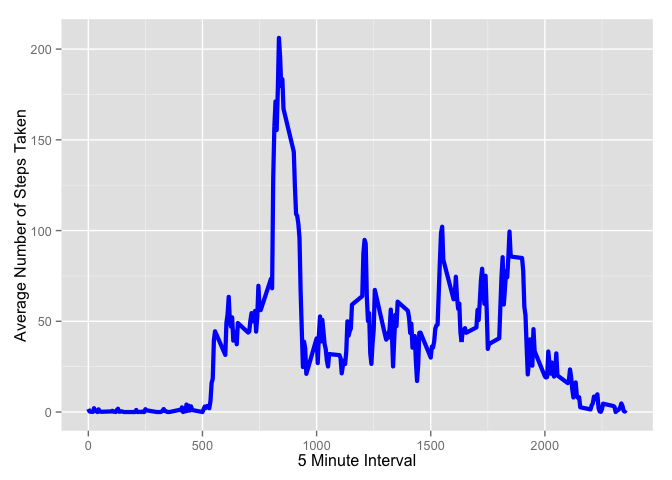
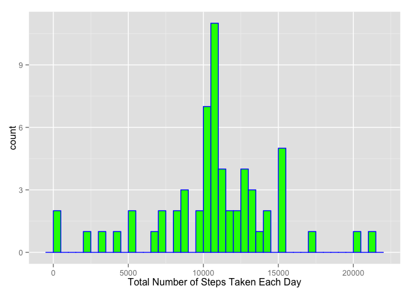
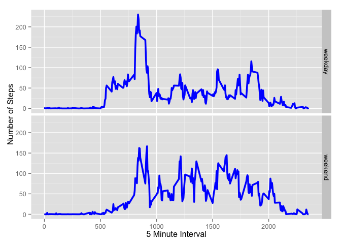

# Reproducible Research: Peer Assessment 1
# Student: Al Shain
## Email: al_shain@me.com
#

# Steps required to reproduce this report:
## Loading and preprocessing the data
#### 1 set workding directory to project

```r
setwd("~/Desktop/Coursera/ReproducibleResearch/PeerAssessment1")
```
#### 2 make sure the libraries for knitr and plotting are loaded

```r
library(knitr)
library(ggplot2)
```
#### 3 set the download, and unzip file name

```r
downloadFile <- "data/activity.zip"
downloadURL <- "https://d396qusza40orc.cloudfront.net/repdata%2Fdata%2Factivity.zip"
```
#### 4 test for data foloder and zip file, if NOT found create

```r
if(!file.exists("./data")) { dir.create("./data")}
if (!file.exists(downloadFile)) {
  download.file(downloadURL, downloadFile, method = "curl");
  unzip(downloadFile, overwrite = T, exdir = ".")
}
```
#### 5 read in the csv data

```r
data <- read.csv("./data/activity.csv")
```
# Calculations and Graphs
### * What is mean total number of steps taken per day?
#### 1 Calculate the total number of steps taken per day

```r
total.steps <- tapply(data$steps, data$date, FUN=sum, na.rm=TRUE)
```
#### 2 Make a histogram of the total number of steps taken each day

```r
qplot(total.steps, binwidth=1000, colour=I("blue"), fill=I("green"), xlab="Total Number of Steps Taken Each Day")
```

 
### * What is the average daily activity pattern?
#### 1 Calculate and report the mean and median of the total number of steps taken per day

```r
mean(total.steps, na.rm=TRUE)  
```

```
## [1] 9354.23
```

```r
median(total.steps, na.rm=TRUE) 
```

```
## [1] 10395
```
#### 2 Make a time series plot (i.e. type = "l") of the 5-minute interval (x-axis) and the average number of steps taken, averaged across all days (y-axis)

```r
averageSteps <- aggregate(x=list(steps=data$steps), by=list(interval=data$interval),
                      FUN=mean, na.rm=TRUE)
ggplot(data=averageSteps, aes(x=interval, y=steps)) +
  geom_line(colour="blue", size=1.5) +
  xlab("5 Minute Interval") +
  ylab("Average Number of Steps Taken")
```

 
### * Which 5-minute interval, on average across all the days in the dataset, contains the maximum number of steps?

```r
averageSteps[which.max(averageSteps$steps),]
```

```
##     interval    steps
## 104      835 206.1698
```
##  Imputing missing values
#### 1 Calculate and report the total number of missing values in the dataset (i.e. the total number of rows with NAs) 

```r
missingValues <- is.na(data$steps)
table(missingValues)
```

```
## missingValues
## FALSE  TRUE 
## 15264  2304
```
#### 2 Devise a strategy for filling in all of the missing values in the dataset.

```r
fill.value <- function(steps, interval) {
  filled <- NA
  if (!is.na(steps))
    filled <- c(steps)
  else
    filled <- (averageSteps[averageSteps$interval==interval, "steps"])
  return(filled)
}
```
#### 3 Create a new dataset that is equal to the original dataset but with the missing data filled in.

```r
filled.data <- data
filled.data$steps <- mapply(fill.value, filled.data$steps, filled.data$interval)
```
#### 4 Make a histogram of the total number of steps taken each day and Calculate and report the mean and median total number of steps taken per day. 

```r
total.steps <- tapply(filled.data$steps, filled.data$date, FUN=sum)
qplot(total.steps, binwidth=500, xlab="Total Number of Steps Taken Each Day", colour=I("blue"), fill=I("green"))
```

 
### * Do these values differ from the estimates from the first part of the assignment? 
### * What is the impact of imputing missing data on the estimates of the total daily number of steps?

```r
mean(total.steps)
```

```
## [1] 10766.19
```

```r
median(total.steps)
```

```
## [1] 10766.19
```
### * Are there differences in activity patterns between weekdays and weekends?  
#### 1 Create a new factor variable in the dataset with two levels – “weekday” and “weekend” indicating whether a given date is a weekday or weekend day.

```r
weekday.or.weekend <- function(date) {
  day <- weekdays(date)
  if (day %in% c("Monday", "Tuesday", "Wednesday", "Thursday", "Friday"))
    return("weekday")
  else if (day %in% c("Saturday", "Sunday"))
    return("weekend")
  else
    stop("invalid date")
}
filled.data$date <- as.Date(filled.data$date)
filled.data$day <- sapply(filled.data$date, FUN=weekday.or.weekend)
```
#### 2 Make a panel plot containing a time series plot (i.e. type = "l") of the 5-minute interval (x-axis) and the average number of steps taken, averaged across all weekday days or weekend days (y-axis). 

```r
averages <- aggregate(steps ~ interval + day, data=filled.data, mean) 
ggplot(averages, aes(interval, steps)) + geom_line() + facet_grid(day ~ .) +
  xlab("5 Minute Interval") + ylab("Number of Steps") +
  geom_line(colour="blue", size=1.25)
```

 
